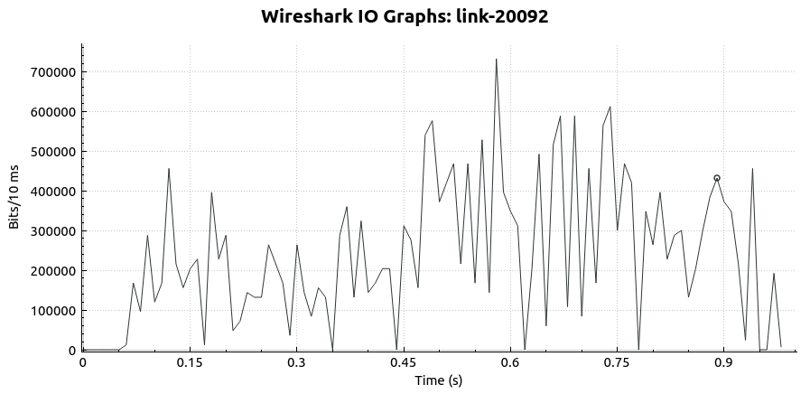
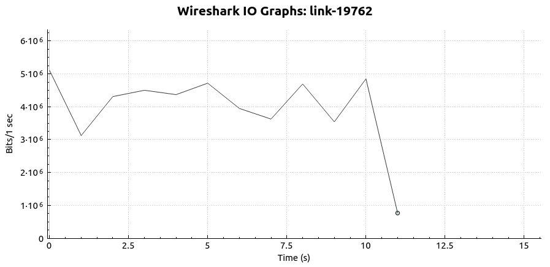
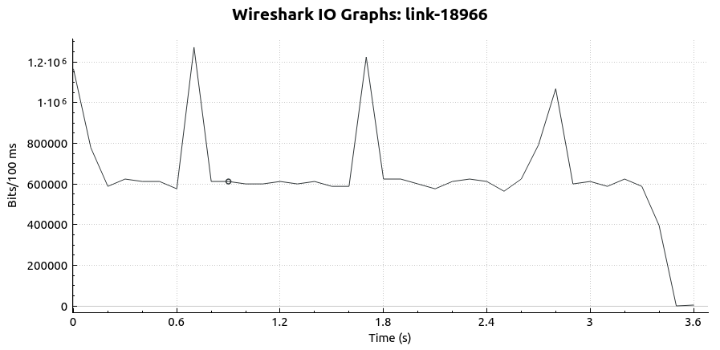

# Graphs

We tested the TCP in various environments of MahiMahi and created throughput and congestion window graph. The congestion window graphs were created by reading the csv file generated by the server in Python. They can be seen in the [Jupyter Notebook](https://github.com/taoprajjwal/Project2-Prajjwal-Romeno/blob/main/Graphs/Plot%20Congestion%20window.ipynb) in this folder.

## Throughput Plots

We measure throughputs by the number of packets sent per second, and use wireshark to generate these plots. In wireshark, we set the filter for the interface that is created by mahimahi and trace all packets in that interface. The resulting plots are given below:

### 10% packet Loss

Command used: mm-loss downlink 0.1 (on the receiver terminal)

### 10% ACK loss

Command used: mm-loss uplink 0.1 (on the receiver terminal)

### Channel traces

Command used: mm-link channel_traces/ATT-LTE-driving-2016.up channel_traces/ATT-LTE-driving-2016.down

---

Cellular Gold

---

Highway Gold

---

Rapid Gold
